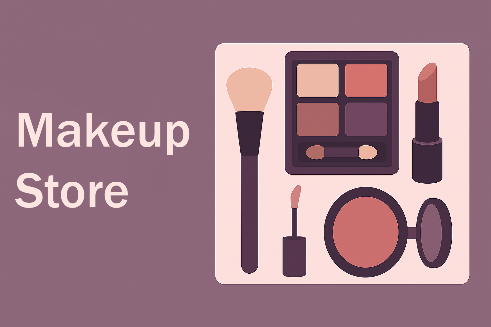

# 💄 Makeup Store Management 🛍️



[](https://www.python.org/)
[](LICENSE)
[]()
[]()

---

## 📖 Overview

**Makeup Store Management** is a beginner-friendly **Python CLI project** to manage a cosmetic shop.
It lets you **add, search, edit, and delete products**.
All data is stored persistently in a simple text-based database: **`record.txt`**.

---

## ✨ Features

| Feature               | Description                               |
| --------------------- | ----------------------------------------- |
| ➕ Add Product         | Add new items to the product list         |
| 🔍 Search             | Find products quickly                     |
| 📝 Edit               | Update existing product details           |
| ❌ Delete              | Remove products from database             |
| 📋 View All Names     | List only product names                   |
| 📦 View All Products  | Show full product details with formatting |
| 🚪 Exit Program       | Gracefully exit the application           |
| 💾 Persistent Storage | Data saved in `record.txt` (with backup)  |

---

## 📂 Project Structure

```
makeup-store/
│── app.py                  # Main program
│── record backup.txt        # Backup (ignored in git)
│── record.txt               # Temporary records (ignored in git)
│── sample.txt               # Example product data
│── banner.png               # Project banner
│── LICENSE                  # License file
│── README.md                # Project documentation
│── tests/
│    └── test_makeupworld.py # Unit tests
│── .gitignore               # Ignore unwanted files
```

---

## 🚀 Installation & Usage

1. Clone the repository:

   ```bash
   git clone https://github.com/Rumaisas-islam/makeup-store.git
   cd makeup-store
   ```

2. Run the program:

   ```bash
   python app.py
   ```

---

## 🧪 Running Tests

This project uses **pytest** for testing.

Run all tests:

```bash
pytest
```

Expected output: ✅ All tests should pass.

---

## 📜 License

This project is licensed under the **MIT License** – see the [LICENSE](LICENSE) file for details.

---

## 🙌 Author

👩‍💻 Developed with ❤️ by **[Rumaisas-islam](https://github.com/Rumaisas-islam)**